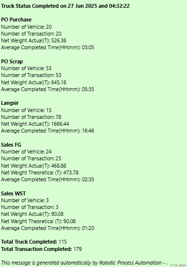

# Truck Status Report Automation - UiPath RPA

This RPA project automates the generation of truck status reports by retrieving data directly from a database, performing data validation and manipulation, and formatting the results into a structured report. The final report is then automatically sent to a WhatsApp group using web automation via WhatsApp Web.

## Project Description

The automation connects directly to the company's database to fetch the latest truck activity data. It validates and processes the data, then formats it into a clear and concise report, which is delivered to the relevant WhatsApp group for real-time monitoring of truck statuses. This solution reduces manual effort, ensures timely reporting, and minimizes human error.

## Features

- Direct integration with SQL database
- Automated data validation and transformation
- Modular workflow structure for scalability and maintainability
- Generates formatted text-based reports for WhatsApp
- Sends the report via web automation on WhatsApp Web (UI-based automation)
- Automated error handling with screenshots of exceptions
- Can be executed manually or scheduled via Orchestrator

## Important Notes on WhatsApp Integration

- This automation uses **UI-based web automation on WhatsApp Web**, not WhatsApp API.
- It requires that WhatsApp Web is logged in on the machine where the robot runs.
- Stability depends on WhatsApp Web's UI layout; significant UI changes might require adjustments to selectors.
- Ensure stable internet connection and that WhatsApp Web is accessible during execution.

## Project Structure

| Folder/File                 | Description                                                   |
|-----------------------------|---------------------------------------------------------------|
| Main.xaml                   | Main entry point of the automation                            |
| Modular/                    | Contains reusable workflows for specific tasks                |
| Data/Config.xlsx             | Stores configuration data such as database connections        |
| Data/Output/                | Folder for generated reports (if needed)                      |
| Framework/                  | REFramework components (if applicable)                        |
| Screenshots/                | Contains sample screenshots of the generated WhatsApp report  |
| Exceptions_Screenshots/     | Stores screenshots captured during exceptions or errors       |
| project.json                 | UiPath project metadata                                       |
| README.md                    | Project documentation                                         |

## Process Workflow

1. **Connect to Database**  
   Retrieves truck status data based on predefined SQL queries.

2. **Data Validation and Manipulation**  
   Cleans the data, validates missing or invalid entries, and summarizes key metrics:
   - Number of vehicles
   - Number of transactions
   - Net weight (actual vs theoretical)
   - Average completion time

3. **Generate Report Text**  
   Converts the processed data into a WhatsApp-friendly text message.

4. **Send Report to WhatsApp Group**  
   Opens WhatsApp Web, navigates to the target group, pastes the report text into the chat box, and sends it using UI automation.

5. **Exception Handling**  
   - Errors are logged systematically.
   - A screenshot is captured when an exception occurs and saved in the `Exceptions_Screenshots` folder for review.

## How to Run

1. Clone or download this repository.
2. Open the project in **UiPath Studio**.
3. Configure the following:
   - Database connection strings in `Data\Config.xlsx`.
   - WhatsApp target group name or UI selectors if needed.
4. Make sure WhatsApp Web is logged in on the machine where the robot is running.
5. Run `Main.xaml` from UiPath Studio or publish to Orchestrator for scheduled execution.

## Sample WhatsApp Report Output

Below is an example of the report that this automation sends to the WhatsApp group:

## Contact

For collaboration, inquiries, or further discussion regarding RPA solutions, feel free to reach out:

- Email: fadillah650@gmail.com
- LinkedIn: https://linkedin.com/in/enrico-naufal-fadilla-54338a256
